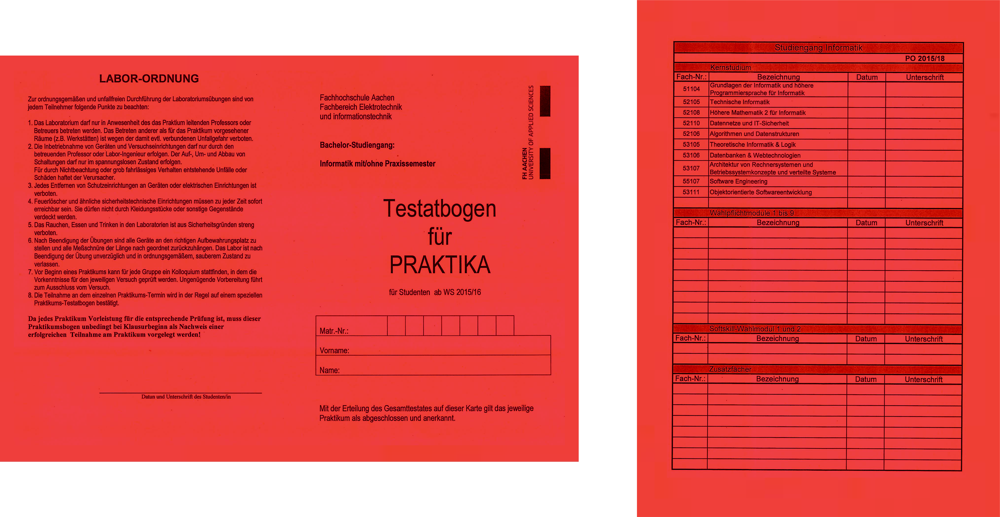
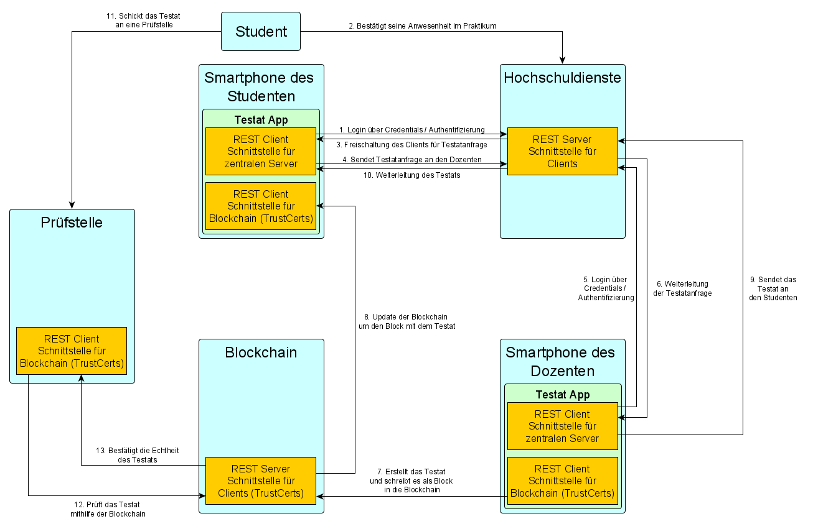
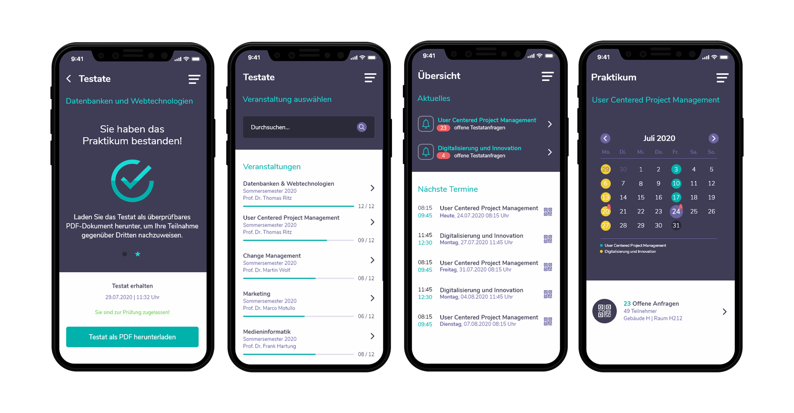

## Use Case: Leistungsnachweise an Hochschulen

Die Veranstaltungen von Fachhochschulen und Universitäten lassen sich in mehrere Teilbereiche unterteilen. Neben dem theoretischen Teil – der Vorlesung – welche in erster Linie der Wissensvermittlung dient, wird im Praktikum einer Veranstaltung das erlernte Wissen vertieft und angewandt. Die Modulpraktika stellen damit einen elementaren Bestandteil der Ausbildung von Studierenden dar, der sie in die Lage versetzen soll, die sich angeeignete fachliche Expertise adäquat einzusetzen. Die Teilnahme an den Praktikumsterminen ist daher für Studierende verpflichtend. Wenn Studierende alle erforderlichen Leistungen innerhalb eines Praktikums erbracht haben, berechtigt sie dies zum Ablegen der Modulprüfung. In anderen Forschungsprojekten wurde bereits bewiesen, dass sich die Blockchain-Technologie dazu eignen kann, digitale und zeitgleich manipulationssichere Hochschulzeugnisse zu generieren, die binnen Sekunden auf ihre Echtheit überprüft werden können. Tatsächlich lässt sich die Integrität solcher Hochschulzeugnisse aber erst dann vollends sicherstellen, wenn bereits die Vorleistungen der Studierenden sicher mit Hilfe der Blockchain dokumentiert werden. So können potenzielle Manipulationsversuche bereits vor der Ausstellung des eigentlichen Hochschulzeugnisses unterbunden werden. Auch wird Studiengangs- und Hochschulwechslern so ermöglicht, bereits erbrachte Vorleistungen mit Bescheinigungen zu belegen, auf deren Echtheit Hochschulen vertrauen können. 

### Der bisherige analoge Prozess:

Die Bescheinigung von erbrachten Leistungen in Modulpraktika gestaltet sich aktuell wie folgt.

1. Studierende erhalten zu Beginn ihres Studiums den **Testatbogen für Praktika** (siehe Abbildung)
2. Regelmäßige Teilnahme der Studierenden an Praktikumsterminen. Die Teilnahme der Studierenden wird auf einer Unterschriftenliste dokumentiert.
3. Erforderliche Abgaben für den jeweiligen Praktikumstermin werden über die Lernplattform ILIAS von Studierenden hochgeladen und anschließend von dem Dozenten überprüft.
4. Nach erfolgter Überprüfung, markiert der Dozent den jeweiligen Praktikumstermin in seinen Unterlagen für den Studierenden als bestanden.
5. Die letzte Veranstaltung des jeweiligen Moduls in einem Semester, wird von Studierenden dazu genutzt, ihren Dozenten den **Testatbogen für Praktika** vorzulegen. Dieser bescheinigt den Studierenden dann mit einer Unterschrift das Absolvieren des Modulpraktikums.
6. Die Studierenden legen den **Testatbogen für Praktika** bei Modulprüfungen vor, um ihre Zugangsberechtigung nachzuweisen.
7. Die Studierenden legen den **Testatbogen für Praktika** bei dem Prüfungsamt vor, um ihre Abschlussarbeit anmelden zu können (als Nachweis für alle erbrachten Leistungen).

#### Hintergründe und Überlegungen zu diesem Prozess:

Der Prozess scheint hinsichtlich der dezentralen Disposition prädestiniert für eine Umsetzung mit der Blockchain-Technologie zu sein:

- Jeder Studierende *sichert* bereits jetzt die persönlich erbrachten Leistungen dezentral (Testatbogen für Praktika).    
- Dozenten dokumentieren ebenfalls dezentral die Teilnahme und Leistungen ihrer Studierenden an den Praktika in ihren eigenen Unterlagen.
- Der **Testatbogen für Praktika** ist für Studierende ein äußerst wichtiges Dokument. Der Verlust führt dazu, dass Studierende die Leistungen erneut mühselig bei den entsprechenden Dozenten bescheinigen lassen müssen. 
- Es bestehen für Hochschulen und Unternehmen nur unzureichende Möglichkeiten, die Echtheit von Leistungsnachweisen zu überprüfen (z.B. Studiengangs- bzw. Hochschulwechsel). Ein dezentrales Netzwerk von Hochschulen könnte diese Lücke schließen.
- Allein an der FH Aachen studieren etwa 15.000 Studierende. Damit handelt es sich um einen Anwendungsfall mit sehr hoher Frequenz – welcher digitalisiert – potenziell den Verwaltungsaufwand minimieren kann.
- Die Integrität von Abschlusszeugnissen ist erst dann sichergestellt, wenn bereits Vorleistungen entsprechend dokumentiert werden. 

### Der digitalisierte Prozess:

Der digitalisierte (blockchaingestützte) Prozess zur Bescheinigung von Leistungsnachweisen an Hochschulen lässt sich wie folgt gliedern.

1. Die Studierenden erhalten zu Beginn ihres Studiums wie bisher ihre Zugangsdaten zu den digitalen Systemen der FH Aachen (z.B. E-Mail, WLAN, ILIAS usw.) Auf diese Weise erhalten die Studierenden auch die Zugangsdaten für das digitale System zur Verwaltung von Leistungsnachweisen an Hochschulen.
2. Die Studierenden scannen einen QR-Code, welchen der Dozent zuvor beispielsweise mit Hilfe eines projektionsfähigen Gerätes zur Verfügung stellt. Auf diese Weise ist eine effiziente Überprüfung der anwesenden Teilnehmer möglich.
3. Nach Beendigung des Termins, laden Studierende ihre Abgaben über das digitale System zur Überprüfung hoch.
4. Der Dozent erteilt den Studierenden nach erfolgreicher Überprüfung das Testat für den entsprechenden Termin.
5. Das System stellt den Studierenden automatisch eine Abschlussbescheinigung für das Modul aus, wenn Studierende alle Einzeltermine des Moduls erfolgreich absolviert haben und verankert gleichzeitig den digitalen Fingerabdruck dieser Bescheinigung in der Blockchain.

### Ausgestellte Leistungsnachweise überprüfen:

Leistungsnachweise, die von Dozenten bzw. Dozentinnen der FH Aachen ausgestellt wurden, lassen sich binnen Sekunden auf Echtheit überprüfen. Eine Verbindung zum Observer der Blockchain ermöglicht den Abgleich der digitalen Fingerabdrücke der Dokumente. 

1. Ein entsprechendes Web-Portal muss aufgerufen werden (als Schnittstelle zwischen Client und Blockchain)
2. Das zu überprüfende Dokument wird ausgewählt.
3. Die Webanwendung berechnet lokal auf dem Rechner des Nutzers den digitalen Fingerabdruck des ausgewählten Dokuments.
4. Der generierte Fingerabdruck wird mit den Einträgen auf der Blockchain abgeglichen.
5. Der Nutzer erhält sofort Rückmeldung, ob das vorliegende Dokument tatsächlich von der FH Aachen ausgestellt wurde.

### Ergebnis:

Der Anwendungsfall „Leistungsnachweise an Hochschulen“ wurde so umgesetzt, dass Studierende einen vollumfänglichen, digitalen Studienbegleiter erhalten. Über den eigentlichen Verifizierungsprozess der Leistungsnachweise hinaus, erwarten Studierende eine Reihe von Funktionalitäten, die ihren Studienalltag angenehmer gestalten können. Studierende können so mit dem System Testate innerhalb von Sekunden verschicken, sich über anstehende Termine informieren, ihre Abgaben hochladen, oder sogar Studienbescheinigungen ausgeben. Dabei wurde im speziellen darauf geachtet, dass die Blockchain lediglich das Werkzeug zur Lösung eines Problems darstellt und nicht die Interaktionsparadigmen der Anwendung bestimmt. Daraus resultiert eine Anwendung, die in den ersten Tests hinsichtlich ihrer Gebrauchstauglichkeit überzeugen kann. Die vom m2c-Lab der FH Aachen generierte Lösung lässt sich potenziell auf viele weitere Hochschulen übertragen, die ein ähnliches Konzept zur Leistungssicherung ihrer Studierenden einsetzen.

### Zusätzliche Informationen:

Um einen reibungslosen operativen Betrieb der Anwendung gewährleisten zu können, müssen die nachfolgenden Schritte zwingend beachtet werden.

##### Server

- Für SSL muss ein Keystore generiert werden und in dem Projekt hinterlegt werden
- Der Speicherort des Keystores muss in der application.properties Datei angegeben werden
	- Das Keystore Passwort muss in der application.properties Datei angegeben werden
	- Das Key Passwort muss in der application.properties Datei angegeben werden
	- Der Key Alias muss in der application.properties Datei angegeben werden
- Der Dateipfad für den Upload von Dateien und Zertifikaten muss in der application.properties Datei angepasst werden
- Das Secret für Json Web Token muss in der application.properties Datei angepasst werden
- Ggf. sollte auch die Ablaufdauer angepasst werden
- In der DBInitializeConfig.java Datei können Datensätze zum initialisieren der Datenbank hinzugefügt werden.

##### App

- In der blockchain_service.dart Datei muss die Adresse zum Observer und Portal Endpunkt geändert werden, außerdem muss ein Private Key eingetragen werden der bei Trustcerts registriert ist. Zusätzlich muss der entsprechende Identifier von Trustcerts eingetragen werden, der zu dem Private Key gehört
- Ggf. muss in der web_service.dart Datei die Adresse zum Server angepasst werden, wenn dieser nicht auf dem Localhost läuft bzw. kein Emulator für die App genutzt wird.

