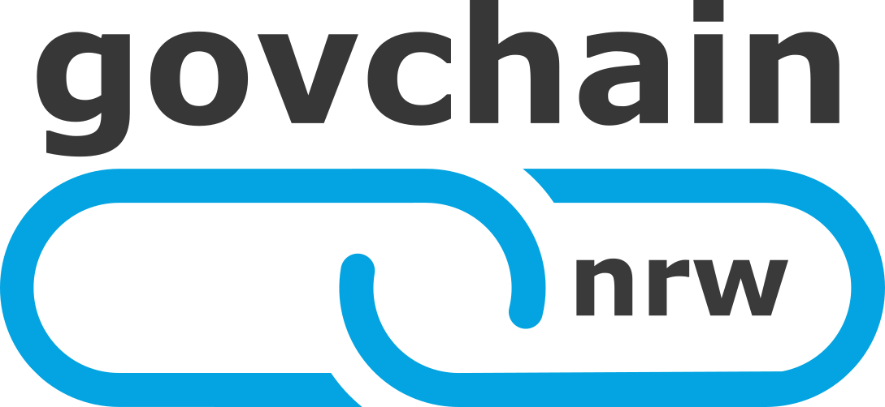

Mit dem Projekt https://govchain-nrw.de/ zu ersten realen Blockchain Use Cases in der öffentlichen Verwaltung    

Der Blockchain-Technologie wird gegenwärtig großes Potenzial für einen Einsatz in verschiedenen Gebieten zugeschrieben, unter anderem auch im öffentlichen Sektor der Kommunalverwaltung, der Ver- und Entsorgung und der Mobilität. Ausschlaggebend dafür ist das technologische Konzept, das der Blockchain zugrunde liegt: Blockchains sind spezielle Datenstrukturen, die ihre Datensätze in einer kontinuierlichen erweiterbaren Liste speichern. Blockchains werden nicht zentral, sondern dezentral auf mehreren Servern und Rechnern gespeichert. Damit diese immer konsistent sind, werden die einzelnen Datenblöcke der Listen mittels kryptografischer Verfahren miteinander verkettet. Ein Konsens über den richtigen Zustand der Daten wird erst dann erzielt, wenn eine Änderung von allen Instanzen akzeptiert und somit validiert wurde. Dieses Konzept wird als Distributed-Ledger-Technologie (DLT) bezeichnet. Der Vorteil liegt darin, dass die Daten nicht zentral administriert und gespeichert werden, sondern durch ein Peer-to-Peer-Netzwerk (P2P) und einen Konsensmechanismus die valide Datenverteilung auf alle Netzwerkknoten und die Datenintegrität garantiert werden (BSI, Themenpapier Blockchain, 2017). Das führt dazu, dass die aufgezeichneten Daten extrem sicher und vertrauenswürdig, da eine nachträgliche Änderung nach der Aufzeichnung technisch so gut wie unmöglich ist.  

Aus der Tatsache, dass die Echtheit, der Ursprung und die Unversehrtheit der gespeicherten Daten überprüfbar sind, ist eine Datenhaltung nicht länger zwingend an eine zentrale Instanz gebunden und es wird eine Basis für die verteilte, vertrauenswürdige und automatisierte Zusammenarbeit sowie ein hohes Potenzial für neue Geschäftsmodelle und Ökosysteme geschaffen. Besonders für die Kommunen und für viele kleine und mittelständische Unternehmen (KMUs) ist Blockchain eine ideale Technologie für eine solche organisationsübergreifende Zusammenarbeit im Netzwerkverbund. Die Digitalisierung der Kommunen geht üblicherweise mit einem hohen Maß an Automatisierung von digitalen Prozessen und Entwicklung neuer Geschäftsmodelle einher - und dafür sind vertrauenswürdige Daten für alle beteiligten Partner von entscheidender Bedeutung. Dies umso mehr, wenn die Geschäftsmodelle agiler werden, neue Partner kurzfristiger an Bord kommen und das Vertrauen, das sich klassisch aus der Erfahrung in langjährigen Geschäftsverbindungen ergibt, durch andere Vertrauensmechanismen ersetzt werden muss.  

Häufig wird für die Digitalisierung kommunaler Prozesse zusätzlich zur Blockchain-Technologie, eine dezentrale Datensammlungs- und Analyseinfrastruktur benötigt, auf deren Grundlage zunächst Massendaten gesammelt und ausgewertet werden können, bevor geprüfte Sachverhalte vorliegen, die innerhalb der Blockchain manipulationssicher und rechtsgültig verwaltet werden können. Vielfach sind die einzelnen Quelldatenpunkte in solchen Anwendungen sogar unpräzise und verdichten sich erst durch Zeitreihenanalyse oder Clustering-Verfahren zu substantiellem und erhärtetem neuem Wissen. Solche Infrastrukturen zur Sammlung und Analyse von Messpunkten dezentraler Objekte (z.B. Sensoren im städtischen Raum, Fahrzeugen) werden auch mit dem Begriff „IoT-Hub“ bezeichnet, der im Folgenden verwendet wird.  

 

Damit die vielversprechende Distributed-Ledger-Technologie nutzenstiftend für verschiedene Anwendungsszenarien in den Kommunen eingesetzt werden kann, ist es sinnvoll, dass in NRW eine ‚Private Government Blockchain-Infrastruktur‘ (govchain nrw) gepaart mit einem IoT-Hub in einem privaten, kommunalen Netzwerk geschaffen wird. Dann wird es möglich organisationsübergreifend für alle Kommunen in NRW die Potenziale der DLT zu heben und effizientere und auch papierlose Prozesse digital zu realisieren. Die verteilte Architektur der Blockchain- und IoT-Technologie, die unter Beteiligung der kommunalen Rechenzentren in NRW (KDN und ProVitako) als Reallabor aufgebaut wird, kann helfen, die Digitalisierung effizient zu gestalten und zu beschleunigen. Um die skizzierte Government Blockchain Infrastructure als Reallabor zu konzipieren, zu entwickeln und auszurollen, übernimmt die Stadt Aachen gemeinsam mit der regio iT die Initiative, um im Rahmen der Modellkommunen diese Innovation zu realisieren. 

