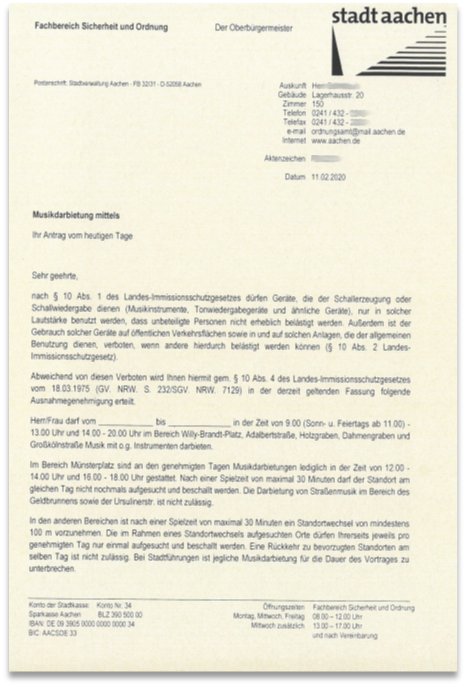
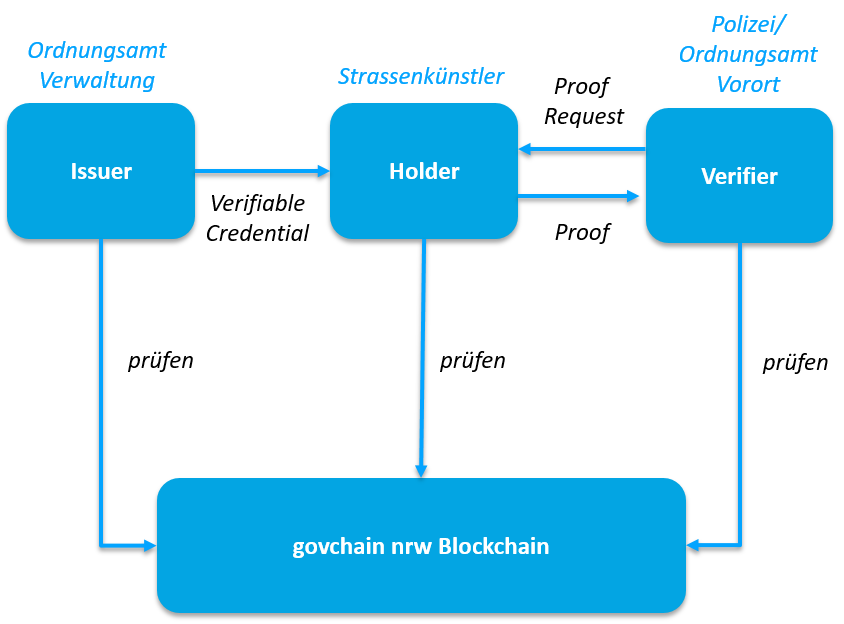
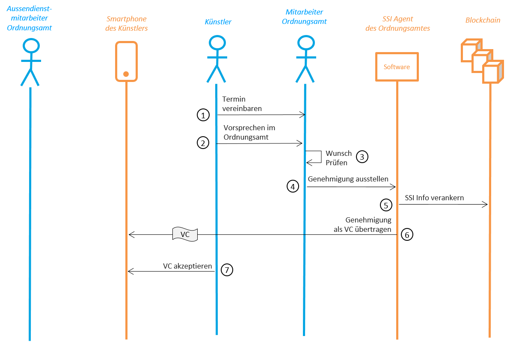

## Use Case "Strassenmusikanten" des Projektes govchain nrw

Um in der Innenstadt in Aachen auf öffentlichen Plätzen musizieren zu können, bedarf es einer Genehmigung des Ordnungsamts der Stadt Aachen, die der Künstler in Form eines Papierdokuments mit sich führen und bei Nachfrage vorzeigen muss. Dieser Use Case wurde im Projekt govchain nrw mit Hilfe von Self Sovereign Identity Technologie (SSI) umgesetzt. Er ist einer von vier Use Cases der Stadt Aachen, die alle auf SSI und der SSI-App "Lissi" basieren.  

  
### Der bisherige analoge Prozess gliedert sich sich in folgende Schritte.  

1. Der Straßenkünstler beantragt in einem Präsenztermin beim Ordnungsamt die Genehmigung in der Stadt zu musizieren.
2. Der Strassenkünster kommt zum vereinbarten Termin zum Ordnunsamt und spricht dort vor.
3. Das Amt stellt nach Prüfung eine Genehmigung in Form eines Papierformular aus und gibt diese dem Künstler mit.  
4. Der Künstler muss auf Nachfrage diese Genehmigung zur Ausübung seiner Darbietung vorweisen.  
  
#### Hintergründen und Überlegungen zu diesem Prozess 
Es handelt sich um einen relativ einfachen Prozess und einen Verwaltungsakt mit geringen Fallzahlen pro Jahr. Es sind daher durch die Digitalisierung weder besonders große Einspaarungen zu erwarten, noch vereinfachen oder verkürzen sich die Abläufe in der Verwaltung signifikant. Die wesentlichen Kritikpunkte an dem bisherigen Ablauf sind:  
- Die papierbasierten Formulare sind relativ einfach zu fälschen.
- Die Ausdrucke können schnell verloren gehen. 
- Der Ausdruck von Formularen auf Papier ist für Dokumente mit kurzer Lebenszeit (1-2 Wochen) energetisch und umwelttechnisch ungünstiger als ein digitales Dokument. 

Das Projekt hat sich aber gerade aus diesen Gründen für eine Umsetzung in Aachen entschieden. Je einfacher und unkritischer der Verwaltungsablauf ist, desto weniger Kritik und Widerstand ist zu erwarten und desto einfacher ist eine erste exemplarische Umsetzung möglich. Die reale Umsetzung und spätere Nutzung soll nach unserer Überlegung bei Bürgern und Verwaltung zum Nachdenken anregen und so zu einer Keimzelle für weitere, im Idealfall relevantere Use Cases werden.   
  
### Der digitalisierte Prozess gliedert sich wie folgt.  
1. Der Straßenkünstler beantragt in einem Präsenztermin beim Ordnungsamt die Genehmigung in der Stadt zu musizieren.
2. Der Strassenkünster kommt zum vereinbarten Termin zum Ordnunsamt und spricht dort vor.
3. Das Amt stellt nach Prüfung eine Genehmigung in Form eines SSI Verifiable Credential aus und schickt dieses an das SSI-Wallet des Künstlers.
4. Das Ordunungsamt fragt in Form eines Proof-Requests die Inhalte des Verfiable Credential ab und prüft diese nach Übertragung automatisiert auf Echtheit, Gültigkeit und Manipulation.  
  
  
  

### Genehmigung ausstellen - Interaktionsdiagramm des digitalen Prozesses  

### Genehmigung prüfen - Interaktionsdiagramm des digitalen Prozesses  

### Fazit

- Umsetzung basiert auf frei verfügbarer Software und Smartphone Apps
  - Hyperledger Indy/Aries  
  - Lissi
- Funktion und Design sind getrennt.
- Umsetzung unabhängig vom eingesetzten Register einer Kommune.

