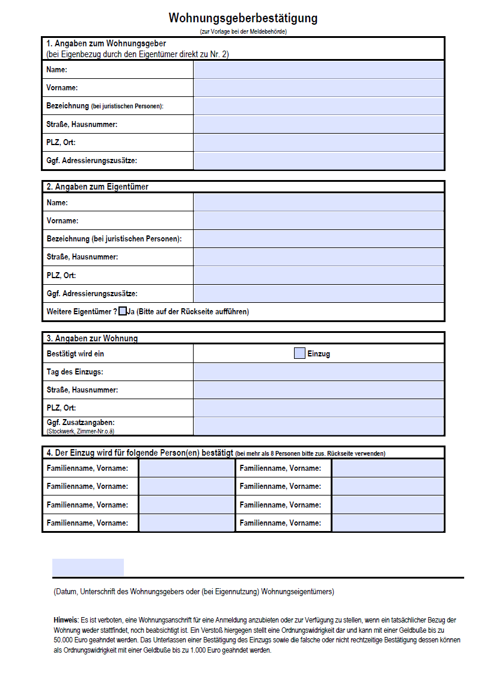

## Use Case "Wohnungsgeberbestätigung" des Projektes govchain nrw

Mit einer Wohnungsgeberbestätigung oder Wohnunsgeberbescheinigung wird einem Mieter für das Enwohnermeldeamt nachgewiesen, das er in eine Wohnung ein- oder ausgezogen ist und nun an diesem Ort wohnhaft ist. Vermieter stellen eine Wohnung zur Miete zur Verfügung, daher müssen sie die Wohnungsgeberbestätigung für das jeweilige Einwohnermeldeamt ausstellen. Der Mieter bekommt die Bestätigung in Form eines Papierdokuments ausgehändigt und muss sich anschließend in einer vorgegebene Frist beim Einwohnermeldeamt melden. Dort wird das Dokument geprüft, die Daten im Einwohnerregister werden geändert und im Ausweis des Mieters wird der neue Wohnort vermerkt.

  

### Der bisherige analoge Prozess gliedert sich sich in folgende Schritte.

1. Der Vermieter geht auf die Webseite der Stadt Aachen und läd sich das Formular als PDF-Dokument runter. Er druckt es anschließend aus und trägt die Daten des zukünftigen Mieters in das Dokument ein und unterschreibt es.
2. Zum Tag der Schlüsselübergabe oder des Einzugs übergibt der Vermieter das ausgefüllte Papierdokument an den Mieter.
3. Der Mieter vereinbart einen Termin mit der zuständigen Meldebehörde, im Fall der Stadt Aachen dem Bürgerservice. 
4. Am vereinbarten Termin übergibt der Vermieter das Dokument zusammen mit seinem Ausweis an den Sachbearbeiter des Bürgerservices.
5. Der Sachbearbeiter prüft das Dokument.
6. Bei positiver Überprüfung aller Angaben ändert der Sachbearbeiter die Einträge im Einwohnerregister. Das Dokument der Wohnungsgeberbestätigung wird anschließend archiviert.

Der letzte Schritt mit der Nummer 7 im Interaktionsdiagramm gehört zum Prozess der Meldebestätigung, der hier für das bessere Verständnis mit abgebildet und in der digitalen Umsetzung des Prozesses integriert ist. 

7. Der Sachbearbeiter stellt dem Mieter eine Meldebestätigung aus, ändert den Wohnort im Ausweis des Mieters und übergibt die Dokumente dem Mieter.

